<h1 align='center'> Recruitment Hub</h1>

<p>Recruitment Hub is a dynamic web portal designed for students and the Training and Placement Officer (TPO) of a particular college to efficiently manage placement drive activities.
  It aims to provide fast access to placement procedures and related activities, simplifying the overall placement process.</p>

<p>The placement process in educational institutions can often be complex and time-consuming. Recruitment Hub is specifically designed to streamline and enhance placement activities, 
  providing both students and the TPO with an efficient and user-friendly platform.</p>

<h2>Technologies Used</h2>

- Frontend : HTML, CSS, JavaScript
- Backend : Java with Spring Boot

## Key Features

1. **Student Profile Management:** Input and manage personal details, educational information, and project details for comprehensive resumes.

<div align="center">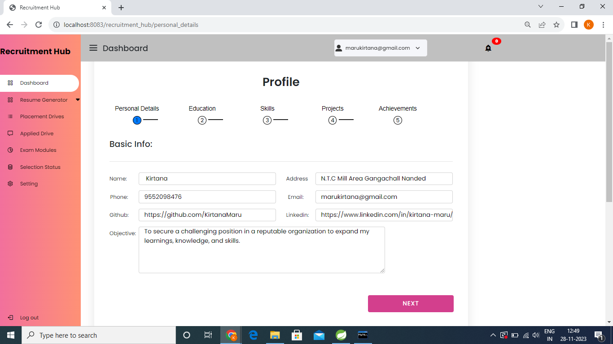</div>

2. **Resume Generation:** Automatically generate resumes for students based on the provided information, with template options.
   <div align="center">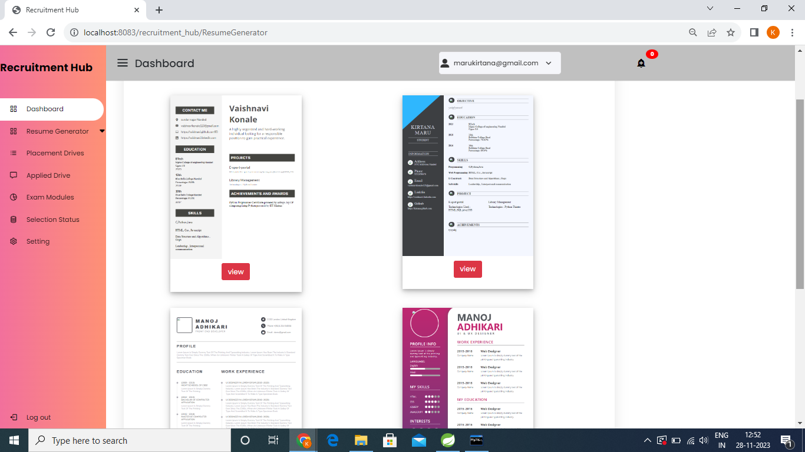</div>

3. **Placement Drive Notifications:** Receive email notifications about upcoming placement drives to ensure timely information.
      <div align="center">
      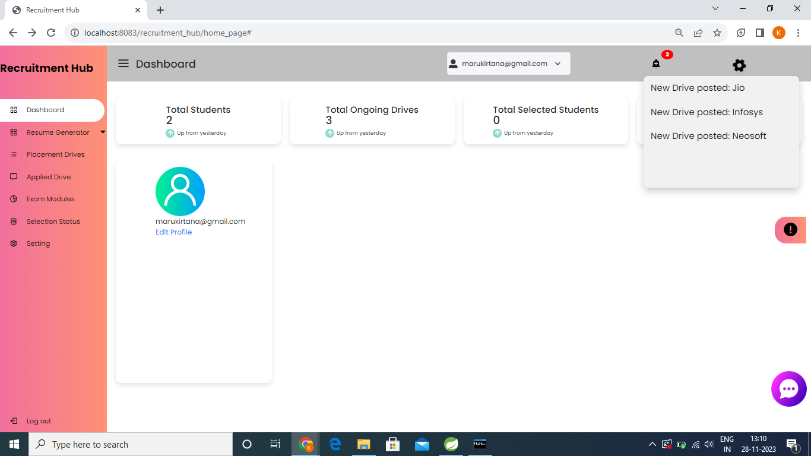
      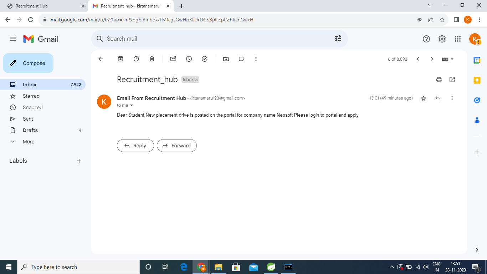</div>

4. **Application and Tracking:** Directly apply for placement drives, with tracking capabilities and status checking.
     <div align="center">
      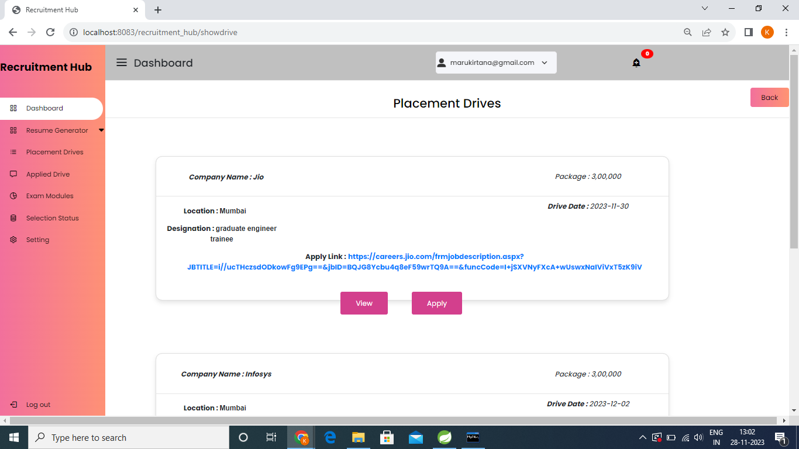
      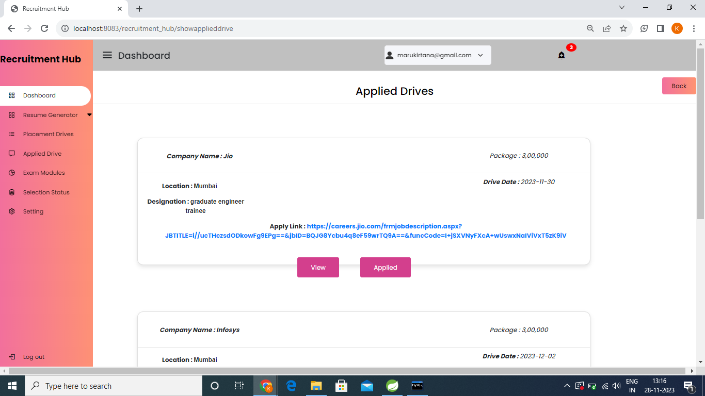
     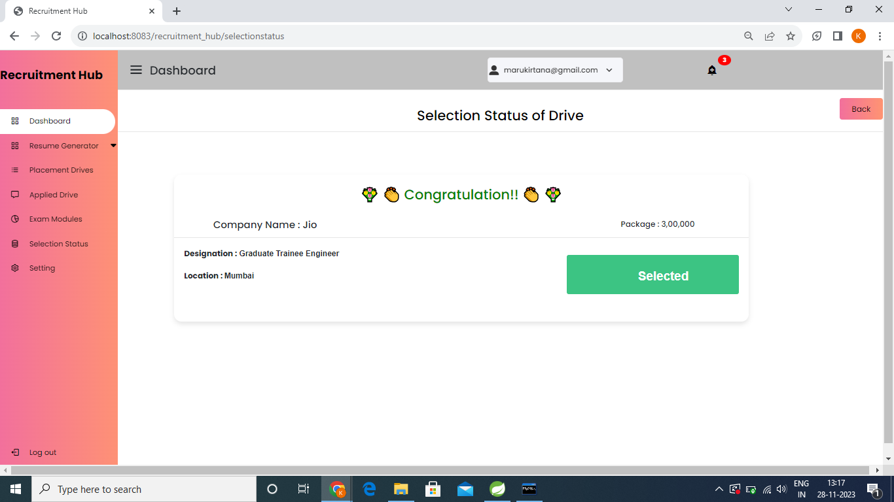</div>

5. **Interactive Chatbot:** Interact with the TPO through a chatbot, facilitating announcements and information sharing.
     <div align="center">
      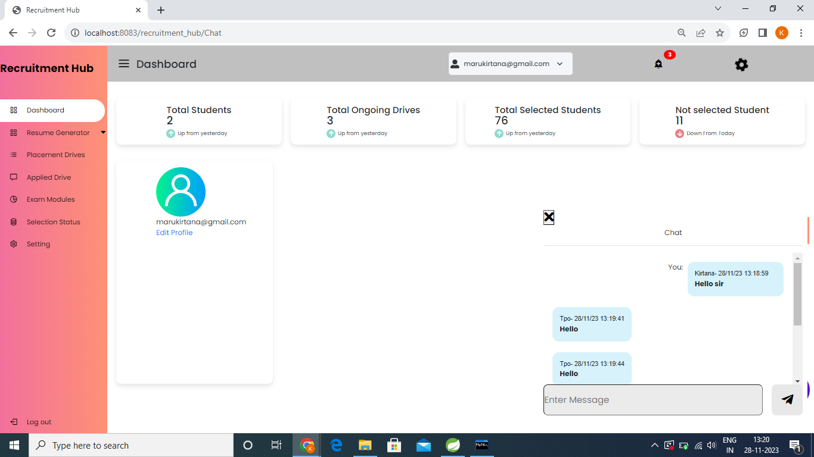
      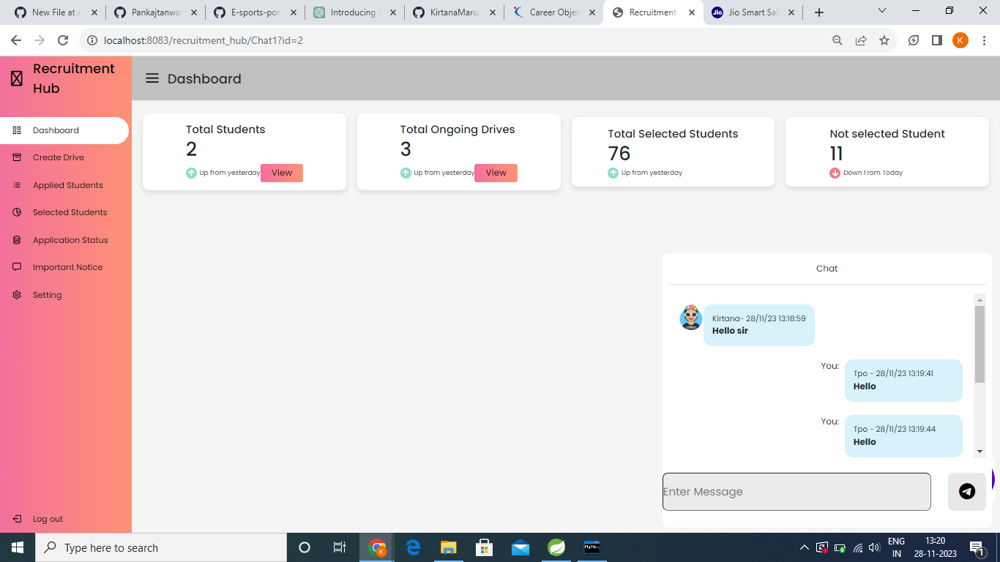</div>

7. **TPO Dashboard:** Access a dedicated dashboard for the TPO to efficiently manage placement activities and view applicant details.
   <div align="center">
      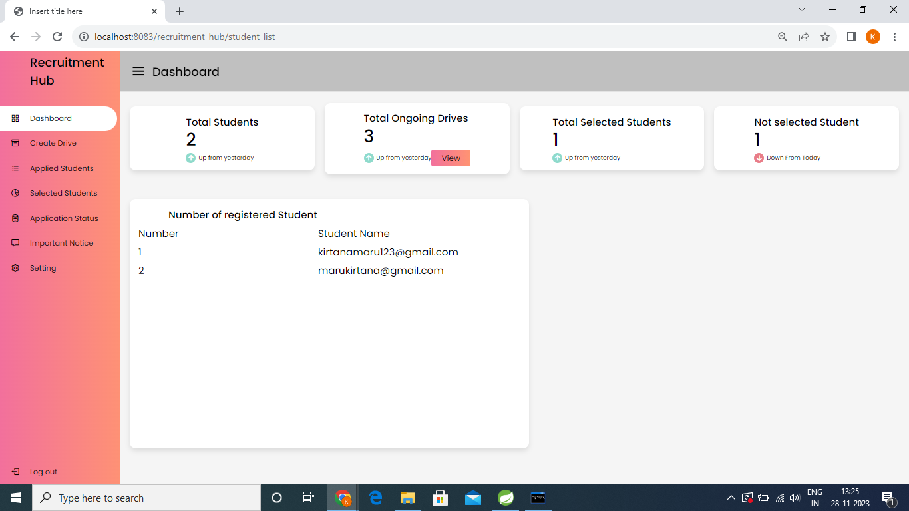
       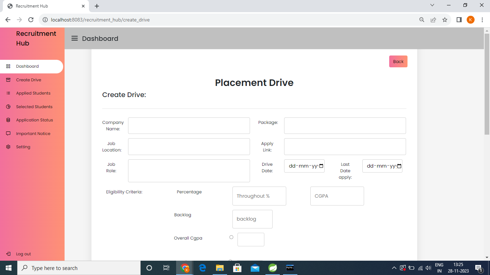
   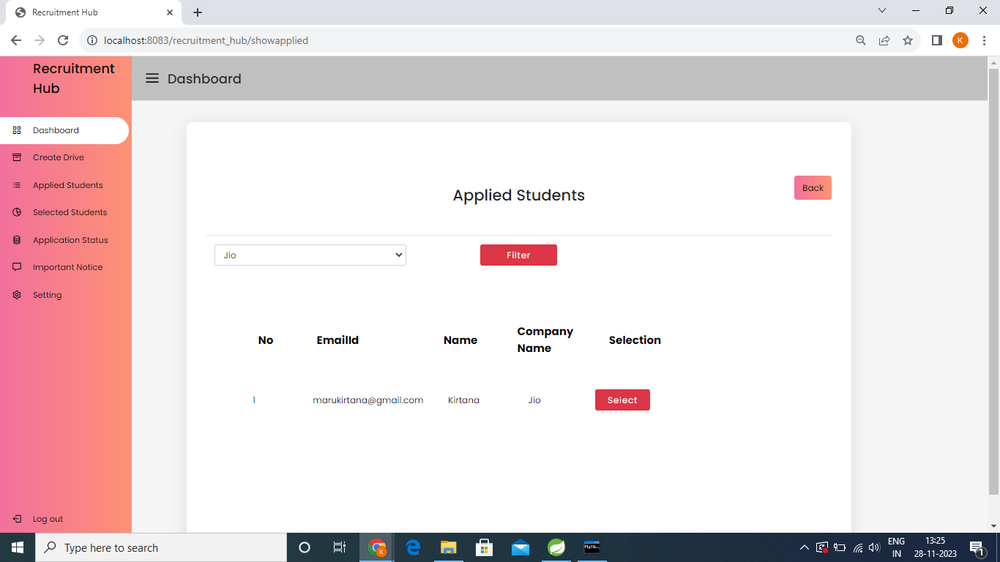</div>

8. **Notice Board and Customization:** Post important notices on the board and customize settings, including background color changes.
     <div align="center">
      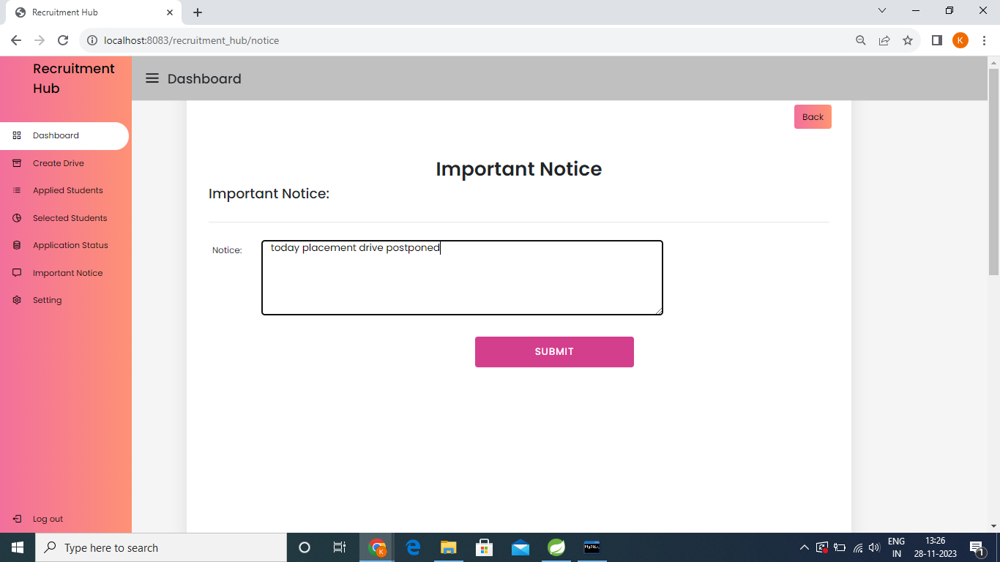
       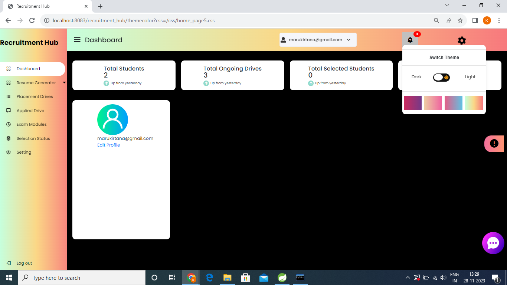
     </div>
  
<h2> Installation </h2>

Follow these steps to set up and run the E-sport Portal locally:

### Prerequisites

Ensure you have the following tools installed on your machine:

- [Java](https://www.oracle.com/java/technologies/javase-downloads.html)
- [Maven](https://maven.apache.org/download.cgi)
- [Git](https://git-scm.com/book/en/v2/Getting-Started-Installing-Git)

1. Clone the repository:

   ```bash
   git clone https://github.com/your-username/your-repository.git

2. Navigate to the project directory:

   ```bash
       cd your-repository
   
3. Build the project:

   ```bash
        ./mvnw clean install
If you're using Windows, use mvnw.cmd instead.

<h2> Running the Application </h2>

Run the application:

         ./mvnw spring-boot:run
Alternatively, run the generated JAR file:

         java -jar target/your-application.jar
Replace your-application.jar with the actual JAR file name generated by Maven.
Access the application in your web browser at http://localhost:8080 or another port if configured differently.
